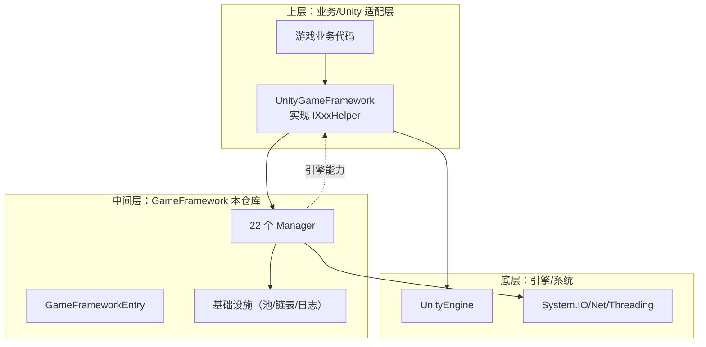
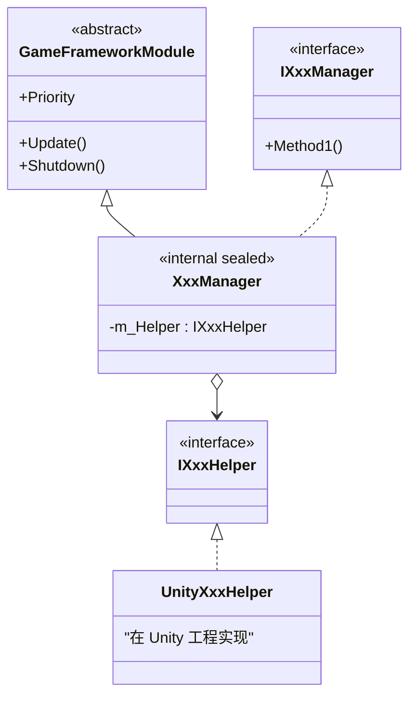
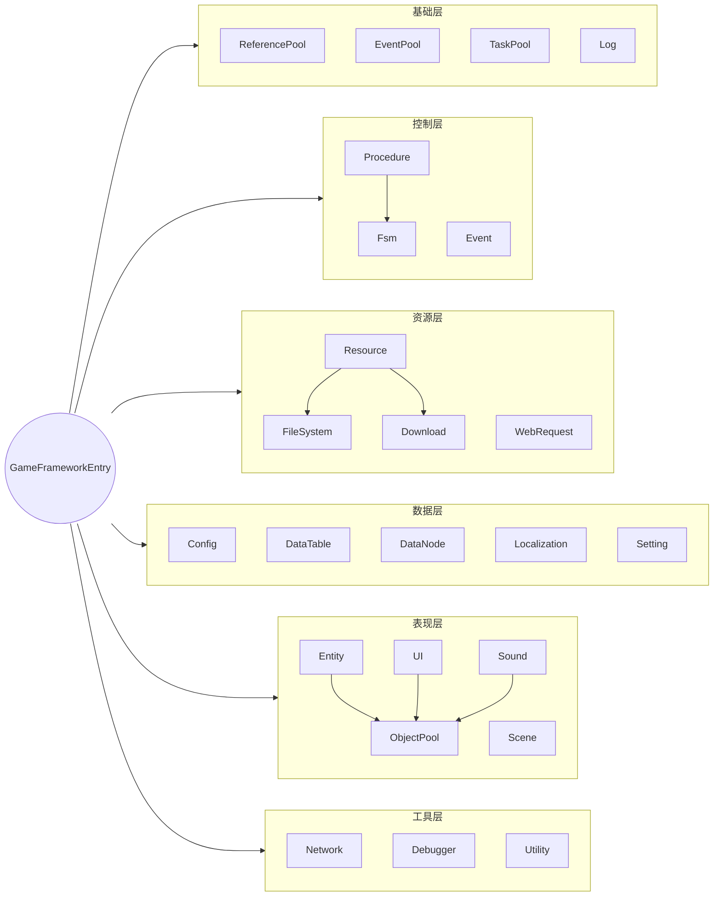

# 第一章 · 架构总览

## 1. 项目是什么？

**GameFramework** 是一个使用 C# 实现的游戏开发框架核心库，由江音 (Jiang Yin) 主导开发，主页 [gameframework.cn](https://gameframework.cn/)。它通常作为 Unity 项目的"核心层"使用，配合上层适配层 *UnityGameFramework* 共同构成完整解决方案。

> 🎯 一句话：**它是一组与游戏引擎解耦的、提供 22 个标准模块的 C# 类库**。

## 2. 项目结构

```
GameFramework/
├── Base/             基础设施（引用池/事件池/任务池/链表/序列化/日志/版本/...）
│   ├── DataProvider/      数据提供器
│   ├── DataStruct/        基础数据结构
│   ├── EventPool/         事件池
│   ├── Log/               日志系统（GameFrameworkLog 含大量重载约 144KB）
│   ├── ReferencePool/     引用池
│   ├── TaskPool/          任务池（异步调度核心）
│   ├── Variable/          泛型 Variable<T>
│   └── Version/           版本号比较
├── Config/           全局键值配置
├── DataNode/         树形运行时数据
├── DataTable/        数值表（对应 Excel）
├── Debugger/         运行时调试器
├── Download/         HTTP 下载
├── Entity/           游戏实体（怪物/子弹/特效）
├── Event/            事件总线
├── FileSystem/       自定义虚拟文件系统
├── Fsm/              有限状态机
├── Localization/     多语言
├── Network/          网络（TCP/Packet/心跳）
├── ObjectPool/       对象池
├── Procedure/        游戏流程（基于 Fsm）
├── Resource/         资源管线（最复杂，30+ 文件）
├── Scene/            场景
├── Setting/          玩家本地设置
├── Sound/            声音
├── UI/               UI（UIGroup/UIForm）
├── Utility/          工具集
└── WebRequest/       HTTP 请求
```

## 3. 三层架构



### 关键设计：接口 + 实现 + Helper



**好处**：
1. 业务代码只见到接口，不会误用内部 API
2. 引擎相关逻辑下沉到上层，本核心库不依赖 Unity
3. 易于单元测试（替换 Mock Helper 即可）

## 4. 模块优先级表（重要）

`GameFrameworkEntry.CreateModule` 会按 Priority **降序**插入到 `LinkedList`：

- `Update` 顺序遍历 → 高优先级先 Update
- `Shutdown` 反向遍历 → 高优先级后 Shutdown

| Priority | 模块 | 说明 |
|---:|---|---|
| 7 | EventManager | 事件分发要最先处理 |
| 6 | ObjectPoolManager | 服务于 Entity/UI/Sound |
| 5 | DownloadManager | 下载任务 |
| 4 | FileSystemManager | 虚拟文件系统 |
| 3 | ResourceManager | 资源 |
| 2 | SceneManager | 场景 |
| 1 | FsmManager | 状态机 |
| 0 | 默认（Config/DataTable/Localization/UI/Sound/Entity/Network/WebRequest/Setting/...） | 业务模块 |
| -1 | DebuggerManager | 调试器最后渲染 |
| -2 | ProcedureManager | 流程在最后驱动 |

## 5. 模块分类视图



## 6. 设计模式速览

| 模式 | 应用 |
|---|---|
| 服务定位器 | `GameFrameworkEntry.GetModule<T>()` |
| 桥接/适配器 | `IXxxHelper` 下沉引擎相关 |
| 对象池 | `ReferencePool` + `ObjectPoolManager` |
| 状态模式 | `Fsm` / `Procedure` |
| 观察者 | `EventManager` + `EventPool` |
| 命令 | `TaskBase` + Agent |
| 组合 | `DataNode`、`DebuggerWindowGroup` |
| 策略 | `ResourceMode` / `EventPoolMode` |
| 分部类 | 大型 Manager 拆为多个 partial 文件 |

➡️ 下一章：[02-核心机制.md](./02-核心机制.md)
