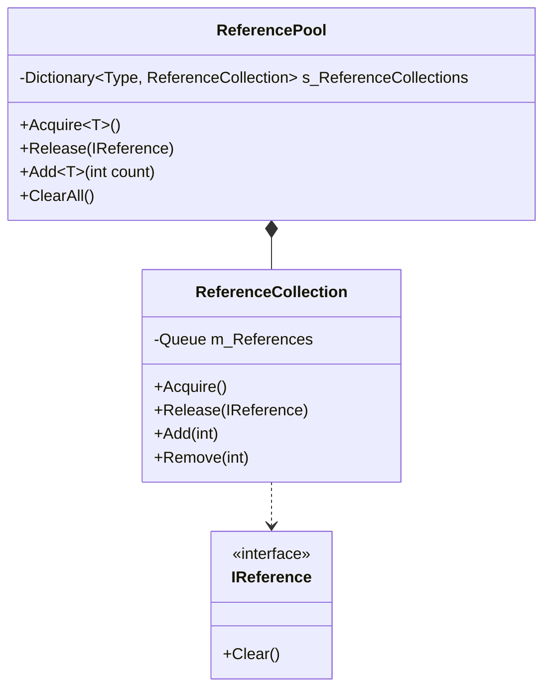
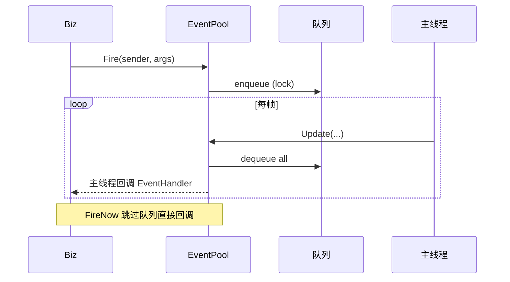
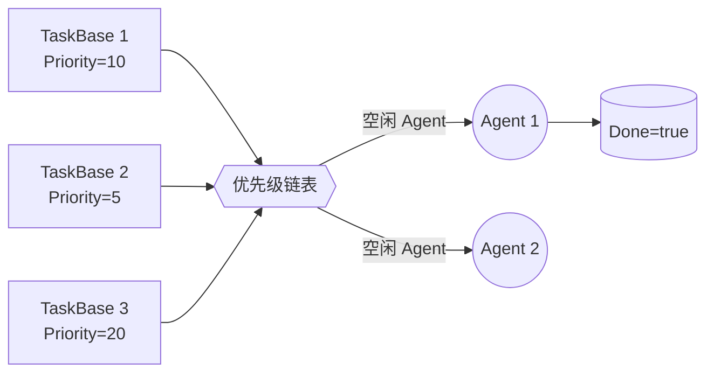
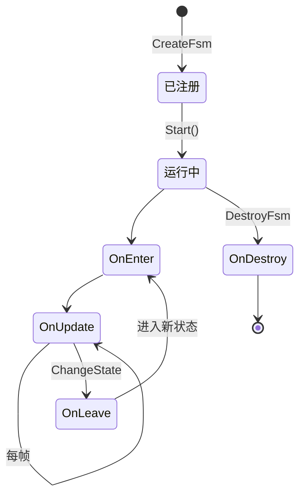

# 第二章 · 核心机制详解

> 这一章是整个框架的"内功心法"，看懂这五个机制，其他业务模块都是套路。

## 1. GameFrameworkEntry：模块系统

文件：`Base/GameFrameworkEntry.cs`

`GameFrameworkEntry` 是一个静态类，做三件事：
1. 反射创建 + 缓存所有 Manager
2. 每帧 `Update`
3. 退出时 `Shutdown`

### 1.1 关键代码（已简化）

```csharp
public static T GetModule<T>() where T : class
{
    Type interfaceType = typeof(T);
    if (!interfaceType.IsInterface)
        throw new GameFrameworkException("must by interface");

    // 命名约定：IEventManager → EventManager
    string moduleName = $"{interfaceType.Namespace}.{interfaceType.Name.Substring(1)}";
    Type moduleType = Type.GetType(moduleName);
    return GetModule(moduleType) as T;
}

private static GameFrameworkModule CreateModule(Type moduleType)
{
    var module = (GameFrameworkModule)Activator.CreateInstance(moduleType);
    // 按 Priority 降序插入
    var current = s_GameFrameworkModules.First;
    while (current != null) {
        if (module.Priority > current.Value.Priority) break;
        current = current.Next;
    }
    if (current != null) s_GameFrameworkModules.AddBefore(current, module);
    else s_GameFrameworkModules.AddLast(module);
    return module;
}
```

### 1.2 命名约定（极重要）

> **接口必须以 `I` 开头，去掉 `I` 后就是同 namespace 下的实现类名。**

| 接口 | 实现 |
|---|---|
| `GameFramework.Event.IEventManager` | `GameFramework.Event.EventManager` |
| `GameFramework.Resource.IResourceManager` | `GameFramework.Resource.ResourceManager` |
| `GameFramework.UI.IUIManager` | `GameFramework.UI.UIManager` |

### 1.3 模块基类 `GameFrameworkModule`

```csharp
internal abstract class GameFrameworkModule
{
    internal virtual int Priority { get { return 0; } }
    internal abstract void Update(float elapseSeconds, float realElapseSeconds);
    internal abstract void Shutdown();
}
```

⚠️ 注意 `internal` —— 外部代码**只能通过接口**访问 Manager。

---

## 2. ReferencePool 引用池

文件：`Base/ReferencePool/`

引用池缓存"实现 `IReference` 的可重用对象"，是事件参数 / 任务 / 节点等高频小对象的核心降耗手段。

### 2.1 使用方式

```csharp
public class MyEvent : GameEventArgs, IReference
{
    public int EventId { get; private set; }

    public static MyEvent Create(int id)
    {
        var e = ReferencePool.Acquire<MyEvent>();
        e.EventId = id;
        return e;
    }

    public void Clear()  // IReference 接口
    {
        EventId = 0;
    }
}

// 调用
var e = MyEvent.Create(1001);
// 用完后归还
ReferencePool.Release(e);
```

### 2.2 内部结构



### 2.3 调试支持

`ReferencePool.GetAllReferencePoolInfos()` 返回每个池的：未使用数 / 使用中数 / 总获取数 / 总归还数 / 总创建数 / 总移除数 → 用于 Debugger 监控。

---

## 3. EventPool 事件池

文件：`Base/EventPool/`

`EventManager`、`SoundManager` 内部都使用了它。它支持：
- **线程安全发送**：`Fire` 把事件入队，下一帧主线程统一分发
- **立即发送**：`FireNow` 当前线程立刻分发
- **三种模式枚举**：

```csharp
[Flags]
public enum EventPoolMode {
    Default = 0,
    AllowNoHandler = 1,         // 允许没有处理器
    AllowMultiHandler = 2,      // 允许多个处理器
    AllowDuplicateHandler = 4,  // 允许重复订阅（一般不开）
}
```

### 3.1 时序图



---

## 4. TaskPool 任务池

文件：`Base/TaskPool/`

> 资源加载、下载、网络请求等异步任务的核心调度器。

### 4.1 模型



### 4.2 关键类型

```csharp
internal abstract class TaskBase : IReference {
    public int SerialId { get; }
    public string Tag { get; }
    public int Priority { get; }
    public bool Done { get; set; }
    public object UserData { get; }
}

internal interface ITaskAgent<T> where T : TaskBase {
    T Task { get; }
    void Initialize(...);
    StartTaskStatus Start(T task);
    void Update(float, float);
    void Reset();
    void Shutdown();
}

public enum StartTaskStatus {
    Done,             // 已完成
    CanResume,        // 可以执行（占用代理）
    HasToWait,        // 等待
    UnknownType,      // 不识别类型
}
```

### 4.3 实战例子

`Resource` 内部就是这套模型：每个 `LoadAssetTask` 是 `TaskBase`，每个 `LoadResourceAgent` 是 `ITaskAgent`。`Download` 同理。

---

## 5. Fsm 有限状态机

文件：`Fsm/`

GameFramework 中所有"流程类"逻辑的基石。`Procedure` 就是一个特化的 FSM。

### 5.1 状态生命周期



### 5.2 使用示例

```csharp
// 1. 定义状态
public class IdleState : FsmState<Monster> {
    protected internal override void OnEnter(IFsm<Monster> fsm) { /* ... */ }
    protected internal override void OnUpdate(IFsm<Monster> fsm,
        float elapseSeconds, float realElapseSeconds)
    {
        if (条件) ChangeState<ChaseState>(fsm);
    }
    protected internal override void OnLeave(IFsm<Monster> fsm, bool isShutdown) { }
}

// 2. 创建并启动
IFsm<Monster> fsm = fsmMgr.CreateFsm("MonsterAI", monster,
    new IdleState(), new ChaseState(), new AttackState());
fsm.Start<IdleState>();
```

### 5.3 状态间共享数据

```csharp
fsm.SetData<VarInt32>("HP", new VarInt32(100));
int hp = fsm.GetData<VarInt32>("HP").Value;
```

---

➡️ 下一章：[03-模块详解.md](./03-模块详解.md)
