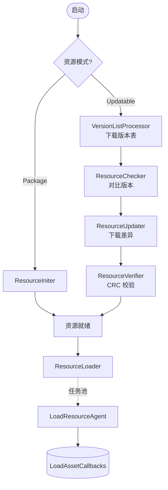
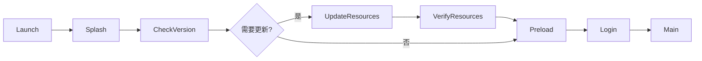
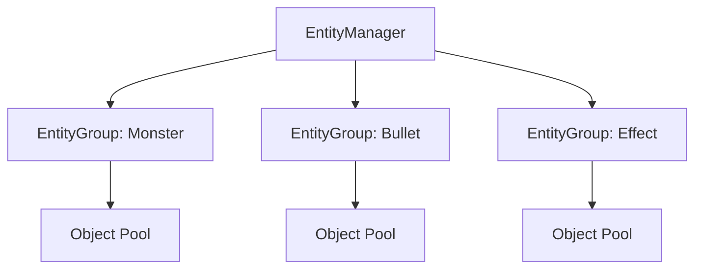
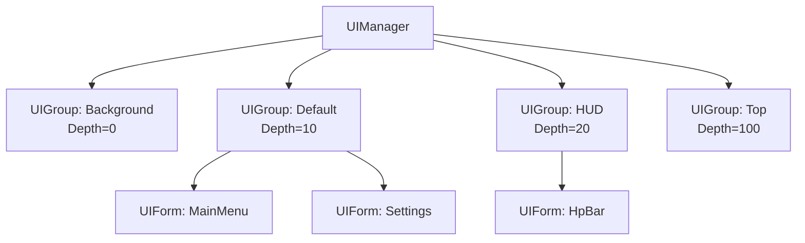
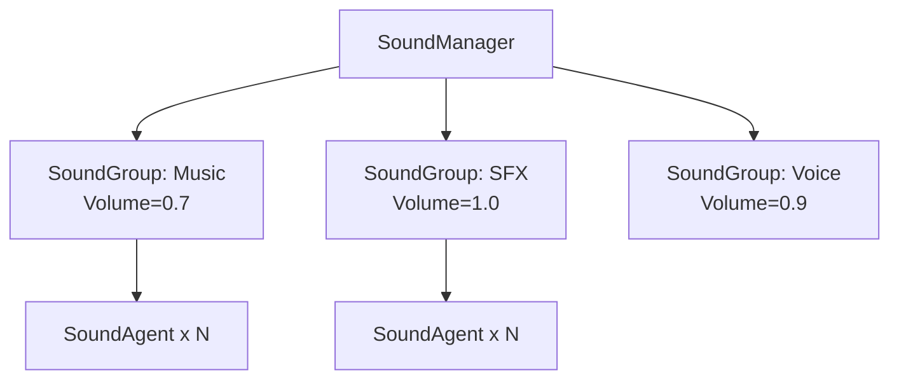
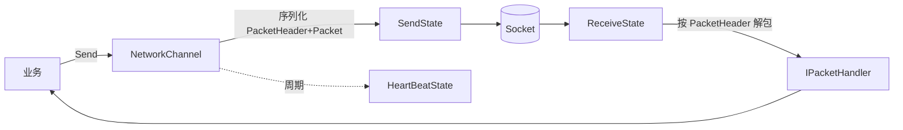
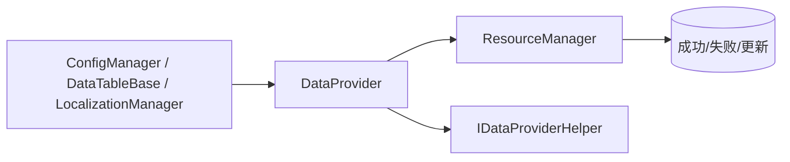

# 第三章 · 22 个模块详解

> 每个模块按"作用 / 关键接口 / 核心概念 / 使用示例"四步骤介绍。

📖 **阅读建议**：模块按"难度 + 重要性"排序，建议从前往后读。

---

## 1. Resource 资源管理 ⭐⭐⭐⭐⭐ (最复杂)

📂 `Resource/`，30+ 个文件，主类 `ResourceManager.cs` 超过 100KB。

### 作用
完成游戏资源的"版本管理 → 增量下载 → 校验 → 加载"全套流水线，并提供异步加载 API。

### 三种资源模式
```csharp
public enum ResourceMode : byte {
    Unspecified = 0,
    Package,                  // 单机模式（资源都在包里）
    Updatable,                // 预下载更新（启动后下完才进游戏）
    UpdatableWhilePlaying,    // 边玩边下（运行时按需下载）
}
```

### 内部子组件（按使用顺序）

| 子组件 | 职责 |
|---|---|
| `ResourceIniter` | 首次启动初始化（Package 模式） |
| `VersionListProcessor` | 下载/解析最新版本表 |
| `ResourceChecker` | 对比 Local/Remote 找出需要更新的 |
| `ResourceUpdater` | 通过 Download 下载差异 |
| `ResourceVerifier` | CRC32 校验 |
| `ResourceLoader` | 加载到内存（背后是 TaskPool） |

### 流程图



### 主要 API

```csharp
// 加载 Asset
resMgr.LoadAsset("Assets/Prefabs/Hero.prefab",
    new LoadAssetCallbacks(
        (assetName, asset, duration, userData) => { /* 成功 */ },
        (assetName, status, errorMessage, userData) => { /* 失败 */ }
    ));

// 加载场景
resMgr.LoadScene("Assets/Scenes/Main.unity", new LoadSceneCallbacks(...));

// 加载二进制
resMgr.LoadBinary("Assets/Configs/Lang.bytes", new LoadBinaryCallbacks(...));
```

---

## 2. ObjectPool 对象池 ⭐⭐⭐⭐⭐

📂 `ObjectPool/`，主类 `ObjectPoolManager.cs` 约 58KB（多种泛型重载）。

### 作用
缓存可重用的对象（如 UI 实例、Entity 实例、Sound Agent），减少 Instantiate/Destroy。

### 核心接口

```csharp
public abstract class ObjectBase : IReference {
    public string Name;
    public object Target;       // 真实承载的对象（Unity 中通常是 GameObject）
    public bool Locked;         // 锁定后不会被自动释放
    public int Priority;        // 释放优先级
    public DateTime LastUseTime;

    protected internal virtual void OnSpawn()   {}
    protected internal virtual void OnUnspawn() {}
    protected internal abstract void Release(bool isShutdown);
}
```

### 自动释放策略

| 配置 | 含义 |
|---|---|
| `Capacity` | 池容量，超过的回收最久未用 |
| `ExpireTime` | 过期时间，超过没用就释放 |
| `AutoReleaseInterval` | 自动检查间隔（秒） |
| `Priority` | 越小越先释放 |
| 自定义 `ReleaseObjectFilterCallback` | 手动决定哪些对象释放 |

### 典型 API

```csharp
// 创建池
var pool = objMgr.CreateMultiSpawnObjectPool<MyObject>("MyPool", capacity: 10);
// 注册（首次创建对象时）
pool.Register(MyObject.Create(target), spawned: true);
// 取
var obj = pool.Spawn();
// 还
pool.Unspawn(obj.Target);
```

---

## 3. Procedure 流程 ⭐⭐⭐⭐⭐

📂 `Procedure/`，仅 3 个文件 —— 它就是 FSM 的特化。

### 关键类

```csharp
public abstract class ProcedureBase : FsmState<IProcedureManager> { }
```

### 用法

```csharp
procedureMgr.Initialize(fsmManager,
    new ProcedureLaunch(),
    new ProcedureCheckVersion(),
    new ProcedureUpdateResources(),
    new ProcedurePreload(),
    new ProcedureLogin(),
    new ProcedureMain());

procedureMgr.StartProcedure<ProcedureLaunch>();
```

### 典型项目流程



---

## 4. Fsm 状态机 ⭐⭐⭐⭐

📂 `Fsm/`，6 个文件。

### 主要 API

```csharp
// 创建
IFsm<T> fsm = fsmMgr.CreateFsm("Name", owner, new StateA(), new StateB());

// 启动 / 切换
fsm.Start<StateA>();
ChangeState<StateB>(fsm);

// 共享数据
fsm.SetData<VarInt32>("Key", new VarInt32(123));
int v = fsm.GetData<VarInt32>("Key").Value;
```

### 状态钩子

| 方法 | 时机 |
|---|---|
| `OnInit` | 状态注册 |
| `OnEnter` | 进入状态 |
| `OnUpdate` | 每帧 |
| `OnLeave` | 离开状态 |
| `OnDestroy` | 销毁 |

---

## 5. Event 事件 ⭐⭐⭐⭐

📂 `Event/`，3 个文件，内部委托给 `EventPool<GameEventArgs>`。

### 用法

```csharp
public class HitEvent : GameEventArgs, IReference
{
    public static readonly int EventId = typeof(HitEvent).GetHashCode();
    public override int Id => EventId;

    public int Damage;

    public static HitEvent Create(int dmg) {
        var e = ReferencePool.Acquire<HitEvent>();
        e.Damage = dmg;
        return e;
    }
    public override void Clear() => Damage = 0;
}

// 订阅
eventMgr.Subscribe(HitEvent.EventId, OnHit);

// 抛出
eventMgr.Fire(this, HitEvent.Create(100));     // 线程安全，下一帧
eventMgr.FireNow(this, HitEvent.Create(100));  // 立即

void OnHit(object sender, GameEventArgs e) {
    var hit = (HitEvent)e;
    // ...
}
```

---

## 6. Entity 实体 ⭐⭐⭐⭐

📂 `Entity/`，主类 `EntityManager.cs` 近 50KB。

### 模型



每个 `EntityGroup` 内部维护一个 `IObjectPool<EntityInstanceObject>`。

### API

```csharp
entityMgr.ShowEntity(entityId, typeof(MonsterLogic), "Assets/Prefabs/Slime.prefab",
    "Monster", priority: 0, userData);
entityMgr.HideEntity(entityId);
```

---

## 7. UI 界面 ⭐⭐⭐⭐

📂 `UI/`，主类 `UIManager.cs`。

### 模型（与 Entity 几乎对称）



### API

```csharp
uiMgr.OpenUIForm("Assets/UI/MainMenu.prefab", "Default");
uiMgr.CloseUIForm(serialId);
uiMgr.RefocusUIForm(formInstance);
uiMgr.HasUIForm(serialId);
```

---

## 8. Scene 场景 ⭐⭐⭐

📂 `Scene/`，8 个文件。

```csharp
sceneMgr.LoadScene("Assets/Scenes/Main.unity", priority: 0, userData);
sceneMgr.UnloadScene("Assets/Scenes/Main.unity");
```

事件：`LoadSceneSuccess/Failure/Update/DependencyAsset` + `UnloadSceneSuccess/Failure`。

---

## 9. Sound 声音 ⭐⭐⭐

📂 `Sound/`，主类 `SoundManager.cs`。



`PlaySoundParams` 提供 3D 声音、音量、音调、循环、淡入等参数。

---

## 10. Network 网络 ⭐⭐⭐⭐

📂 `Network/`，约 20 个文件。

### 模型



### 核心抽象

```csharp
public interface IPacketHeader { int PacketLength { get; } }
public abstract class Packet : IReference { public abstract int Id { get; } public abstract void Clear(); }
public interface IPacketHandler { int Id { get; } void Handle(object sender, Packet packet); }
public interface INetworkChannelHelper {
    void Initialize(INetworkChannel channel);
    int PacketHeaderLength { get; }
    void PrepareForConnecting();
    bool SendHeartBeat();
    bool Serialize<T>(T packet, Stream destination) where T : Packet;
    IPacketHeader DeserializePacketHeader(Stream source, out object customErrorData);
    Packet DeserializePacket(IPacketHeader header, Stream source, out object customErrorData);
}
```

### 通道类型
- `TcpNetworkChannel`：异步 TCP
- `TcpWithSyncReceiveNetworkChannel`：发异步、收同步（解决某些平台兼容）

---

## 11. Download 下载 ⭐⭐⭐

📂 `Download/`，14 个文件。

```
DownloadManager
├── DownloadAgent (n 个并发代理)
├── DownloadTask (TaskBase 子类)
└── DownloadCounter (实时速度，滑动窗口)
```

API：

```csharp
int taskId = downloadMgr.AddDownload(downloadPath, downloadUri, tag, priority, userData);
downloadMgr.RemoveDownload(taskId);
```

事件：`DownloadStart/Update/Success/Failure`。

---

## 12. WebRequest HTTP 请求 ⭐⭐

📂 `WebRequest/`，结构与 Download 极相似（Manager + Agent + Task）。
适合做"短连接"接口（登录、获取签名）。

```csharp
int id = webMgr.AddWebRequest("https://api.xxx.com/login",
                              postData: bodyBytes, userData: ud);
```

---

## 13. Config 全局配置 ⭐⭐

📂 `Config/`，4 个文件。

> 解决"全局开关 / 单值数值"。**和 DataTable 区分：DataTable 是行表，Config 是扁平 K-V**。

```csharp
configMgr.AddBool("HasGuide", true);
configMgr.AddInt("MaxFps", 60);
configMgr.AddFloat("AudioMasterVolume", 1.0f);
configMgr.AddString("ServerUrl", "https://...");

bool b = configMgr.GetBool("HasGuide");
int  i = configMgr.GetInt("MaxFps", defaultValue: 30);
```

加载：

```csharp
configMgr.ReadData("Assets/Configs/AppConfig.bytes");
```

---

## 14. DataTable 数据表 ⭐⭐⭐

📂 `DataTable/`，7 个文件。对应 Excel 配置。

```csharp
public class HeroRow : IDataRow {
    public int Id { get; private set; }
    public string Name { get; private set; }
    public int Hp { get; private set; }
    public bool ParseDataRow(string dataRowString, object userData) { /* 解析一行 */ }
    public bool ParseDataRow(byte[] dataRowBytes, int startIndex, int length, object userData) { /* 二进制 */ }
}

var table = dataTableMgr.CreateDataTable<HeroRow>();
dataTableMgr.LoadDataTable("Assets/Configs/Hero.bytes");

// 用
HeroRow hero = table.GetDataRow(1001);
HeroRow[] heroes = table.GetDataRows(r => r.Hp > 100);
```

---

## 15. DataNode 数据结点 ⭐⭐

📂 `DataNode/`，4 个文件。**带路径的 K-V 树**。

```csharp
dataNodeMgr.SetData<VarInt32>("Player.Bag.GoldCount", new VarInt32(1000));
int gold = dataNodeMgr.GetData<VarInt32>("Player.Bag.GoldCount").Value;
dataNodeMgr.RemoveNode("Player.Bag");
```

适合存"运行时全局变量"。

---

## 16. Localization 本地化 ⭐⭐

📂 `Localization/`，4 个文件。

```csharp
locMgr.Language = Language.ChineseSimplified;
string s = locMgr.GetString("Hello", "World");  // 类似 string.Format
```

`Language` 枚举包含数十种语言（含中、英、日、韩、阿拉伯、各小语种等）。

---

## 17. Setting 玩家设置 ⭐⭐

📂 `Setting/`，3 个文件。

```csharp
settingMgr.SetInt("Quality", 2);
settingMgr.SetFloat("Volume", 0.8f);
settingMgr.Save();    // 持久化（上层用 PlayerPrefs/文件）
```

---

## 18. FileSystem 虚拟文件系统 ⭐⭐⭐⭐

📂 `FileSystem/`，主类 `FileSystem.cs` 约 50KB。

### 用途
把多个小文件 **打包到一个大文件** 里，运行时按"虚拟路径"读取。
- 减少 IO 数（移动平台关键）
- 加密保护
- 热更增量包

### 文件格式

```
┌───────────────────┐
│  HeaderData       │  魔法字 + 加密字节 + 最大文件数 + 最大块数
├───────────────────┤
│  StringData[]     │  文件名字符串区
├───────────────────┤
│  BlockData[]      │  块表（StringIndex + Offset + Length）
├───────────────────┤
│  Block 数据区     │  实际文件内容
└───────────────────┘
```

### API

```csharp
IFileSystem fs = fsMgr.CreateFileSystem("MyArchive.dat",
    FileSystemAccess.ReadWrite, maxFileCount: 1024, maxBlockCount: 1024);
fs.WriteFile("config.json", "C:/data/config.json");
byte[] data = fs.ReadFileBytes("config.json");
```

---

## 19. Debugger 调试器 ⭐⭐

📂 `Debugger/`，5 个文件。

按 `DebuggerWindowGroup` 树状组织 `IDebuggerWindow`：

```csharp
debugMgr.RegisterDebuggerWindow("System/FPS", new FpsCounterWindow());
debugMgr.RegisterDebuggerWindow("Console", new ConsoleWindow());
debugMgr.RegisterDebuggerWindow("Profiler/RefPool", new RefPoolWindow());
```

---

## 20. Utility 工具集 ⭐⭐⭐

📂 `Utility/`，14 个文件。每个都是 `Utility.XxxClass` 的静态类形式。

| 子工具 | 主要能力 |
|---|---|
| `Utility.Assembly` | 反射程序集、查找派生类型 |
| `Utility.Compression` | 压缩/解压（接口） |
| `Utility.Converter` | 类型转换、字节序 |
| `Utility.Encryption` | 异或加解密 |
| `Utility.Json` | JSON（接口） |
| `Utility.Marshal` | 非托管内存缓存 |
| `Utility.Path` | 路径规范化 |
| `Utility.Random` | 线程安全随机 |
| `Utility.Text` | StringBuilder 池、Format |
| `Utility.Verifier` | CRC32 |

---

## 21. Base 基础设施 ⭐⭐⭐⭐⭐ (内功)

`Base/` 目录 = 引用池 + 事件池 + 任务池 + 日志 + 链表 + 序列化 + 变量 + 版本 + 异常。已在第二章详述。

亮点：
- **`GameFrameworkLog`**：超过 144KB —— 所有日志方法的零分配重载。
- **`GameFrameworkLinkedList<T>`**：自带节点池的链表，多线程友好。
- **`GameFrameworkMultiDictionary<TKey,TValue>`**：一对多字典。

---

## 22. DataProvider 数据提供器（基础设施）

📂 `Base/DataProvider/`

它是 `Config / DataTable / Localization` 三个模块**共享的基类**：抽象"数据加载 → 解析 → 完成/失败/进度事件"的通用流程，避免三处重复造轮子。



---

➡️ 下一章：[04-典型流程.md](./04-典型流程.md)
