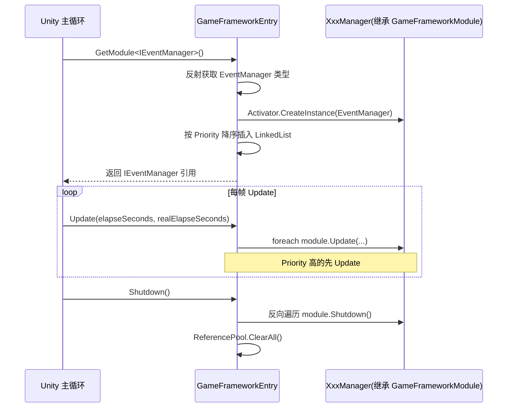
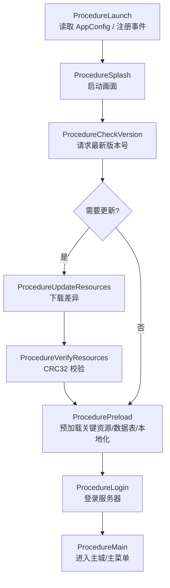
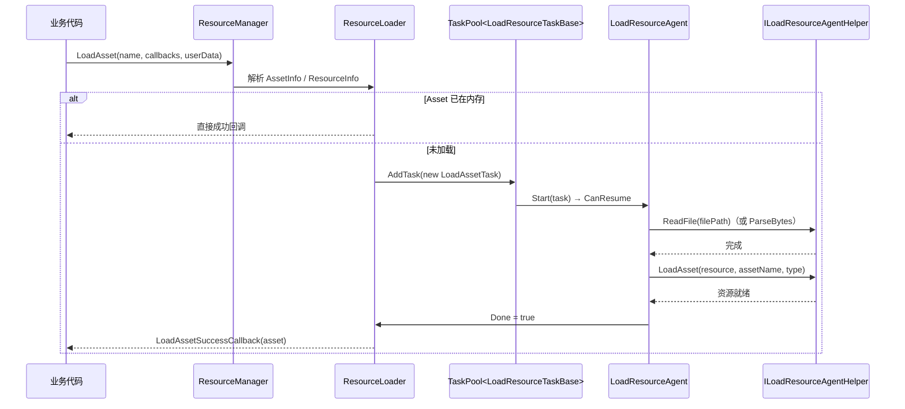
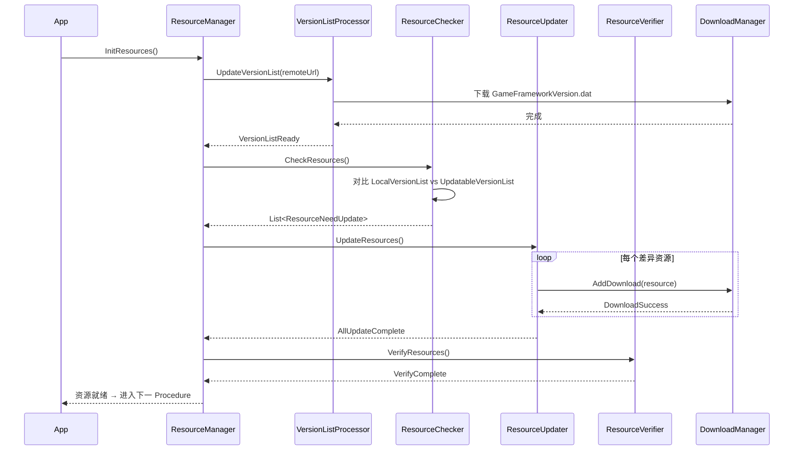
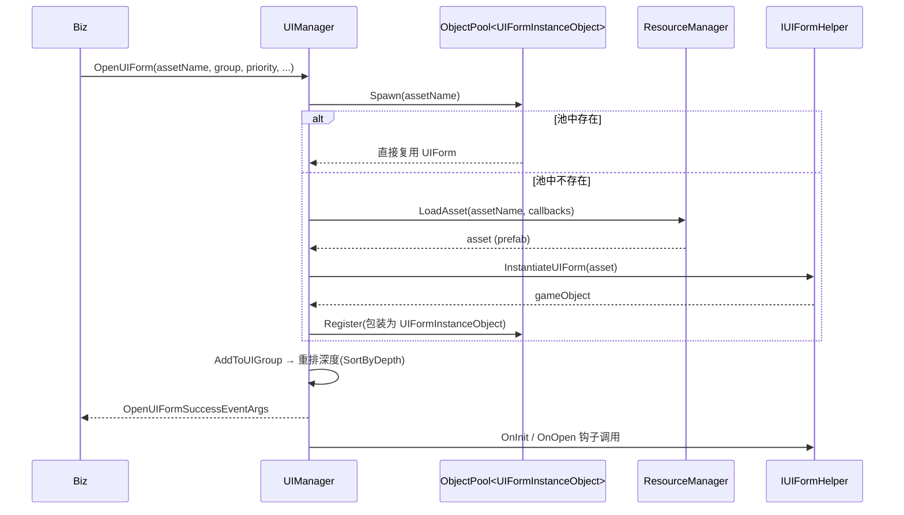
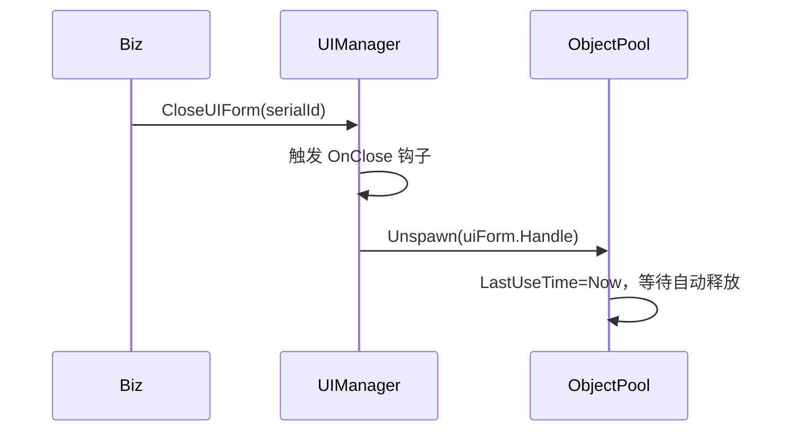
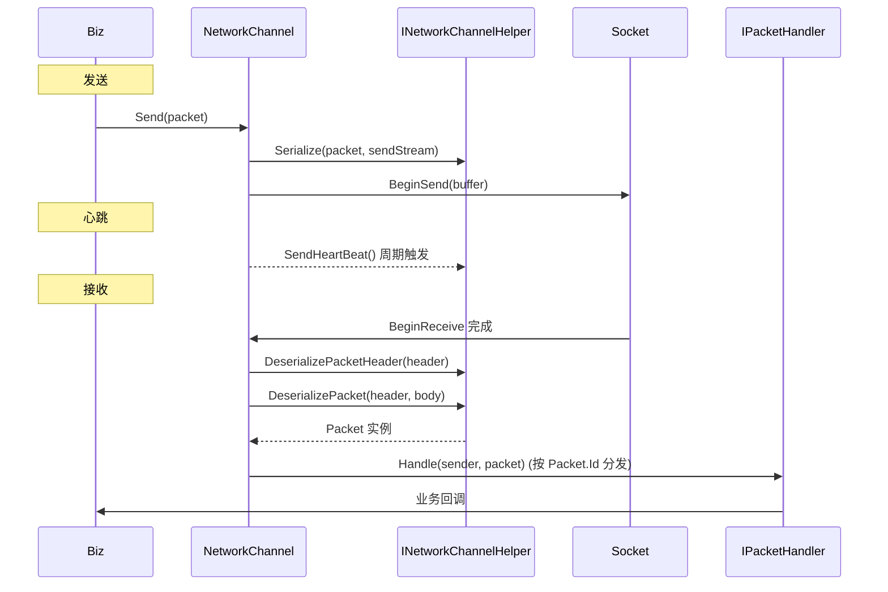
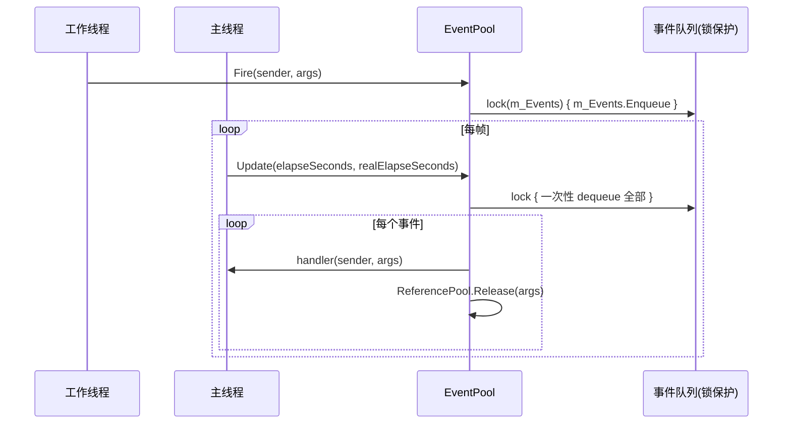
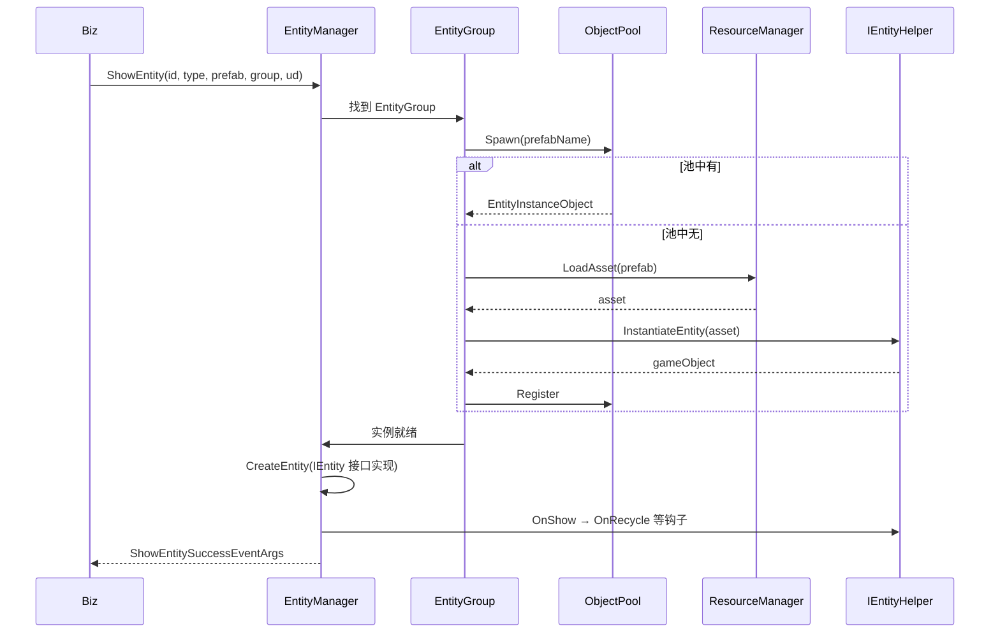

# 第四章 · 典型流程示例

> 本章用时序图 + 流程图展示几个最常见的运行时流程，把前面的模块串起来。

## 1. 框架启动到模块第一次 Update

---

## 2. 完整启动流程（基于 Procedure）

实际项目中每个 Procedure 内部，会用 `ChangeState<NextState>(fsm)` 做状态切换。

---

## 3. 资源加载完整时序（LoadAsset）

依赖资源：`LoadAssetTask` 会检测依赖，自动派发 `LoadDependencyAssetTask`，所有依赖都完成后才回调成功。

---

## 4. 资源更新流程（Updatable 模式）

---

## 5. UI 打开 / 关闭

### 打开

### 关闭

---

## 6. 网络通信收发流程

---

## 7. 事件系统的"线程安全"是怎么做到的？

> 💡 因此你在异步回调（HTTP/Socket 线程）里 `Fire` 完全安全，且事件处理逻辑保证在主线程执行。

---

## 8. 实体显示流程

---

➡️ 下一章：[05-学习路径.md](./05-学习路径.md)
