# 架构图与时序图汇总

> 本文件汇总了所有重要的可视化图表，便于在不打开 HTML 的情况下集中查阅。

## 1. 三层架构

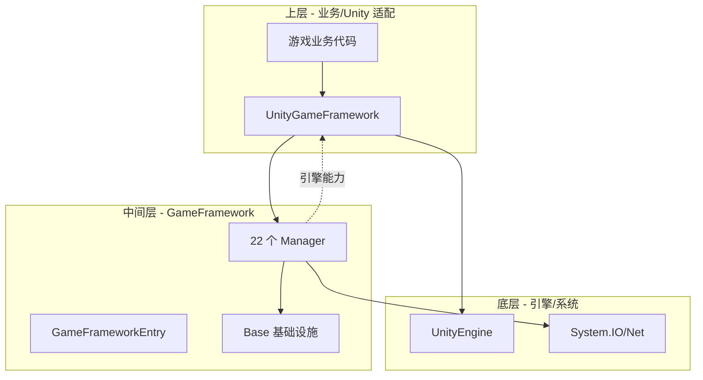

## 2. 模块全景

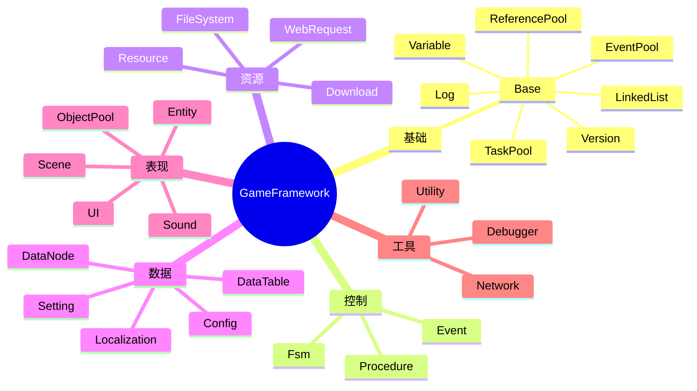

## 3. 模块加载时序

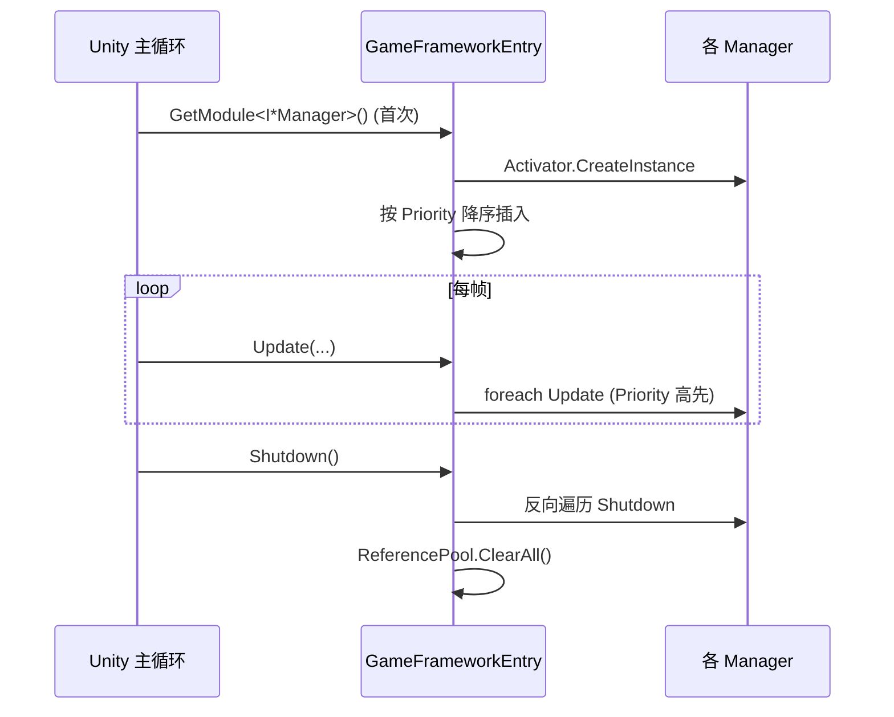

## 4. 接口 + 实现 + Helper 模式

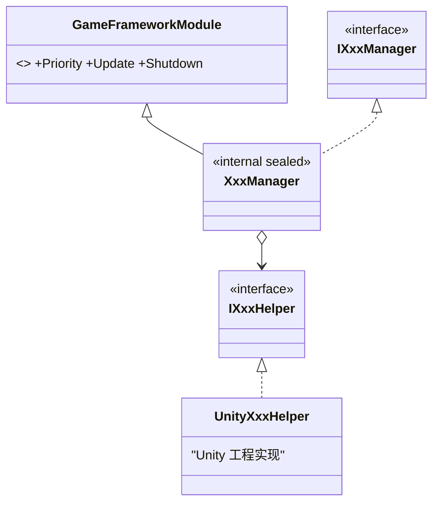

## 5. 引用池

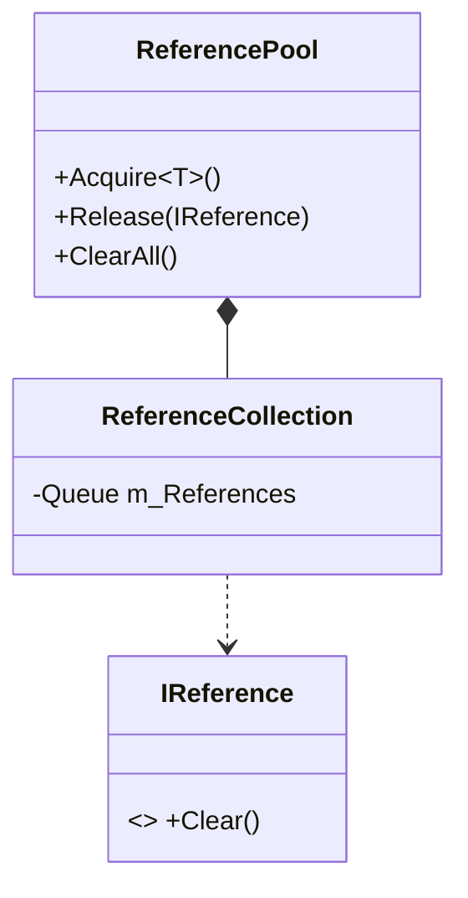

## 6. 事件池时序

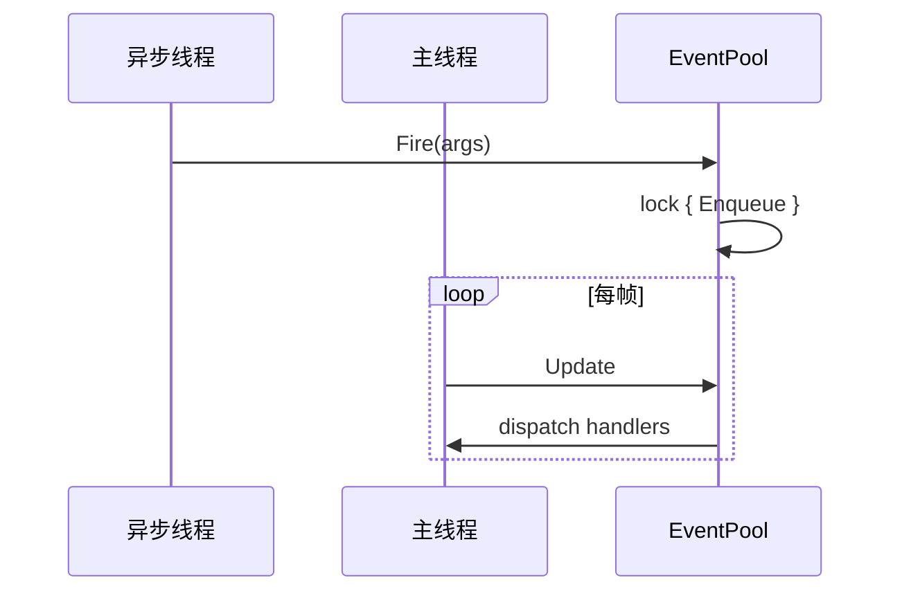

## 7. 任务池模型

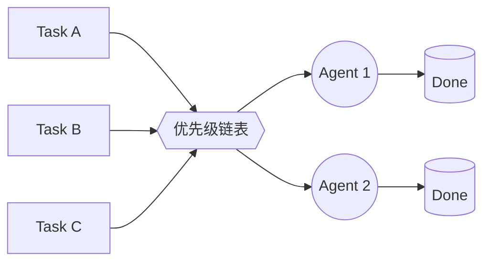

## 8. FSM 生命周期

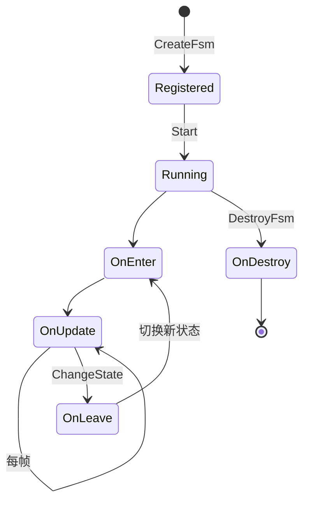

## 9. 启动 Procedure 流程

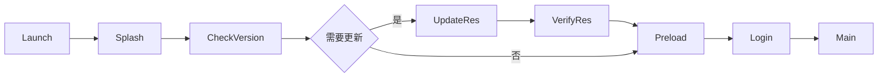

## 10. 资源加载

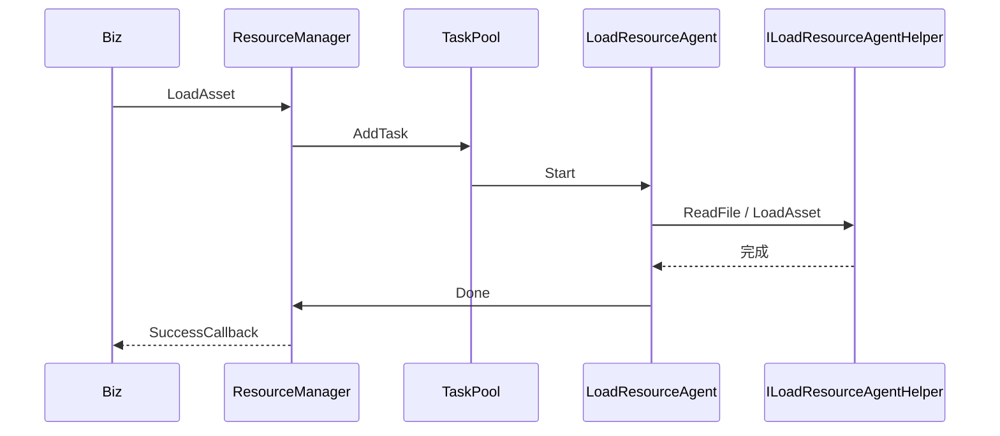

## 11. 资源更新

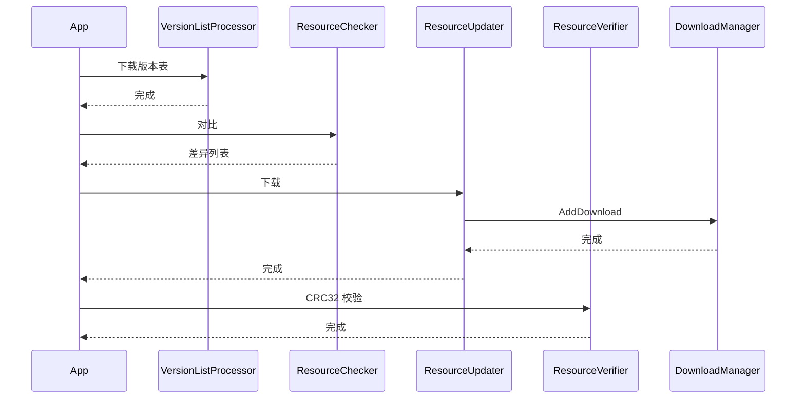

## 12. UI 打开

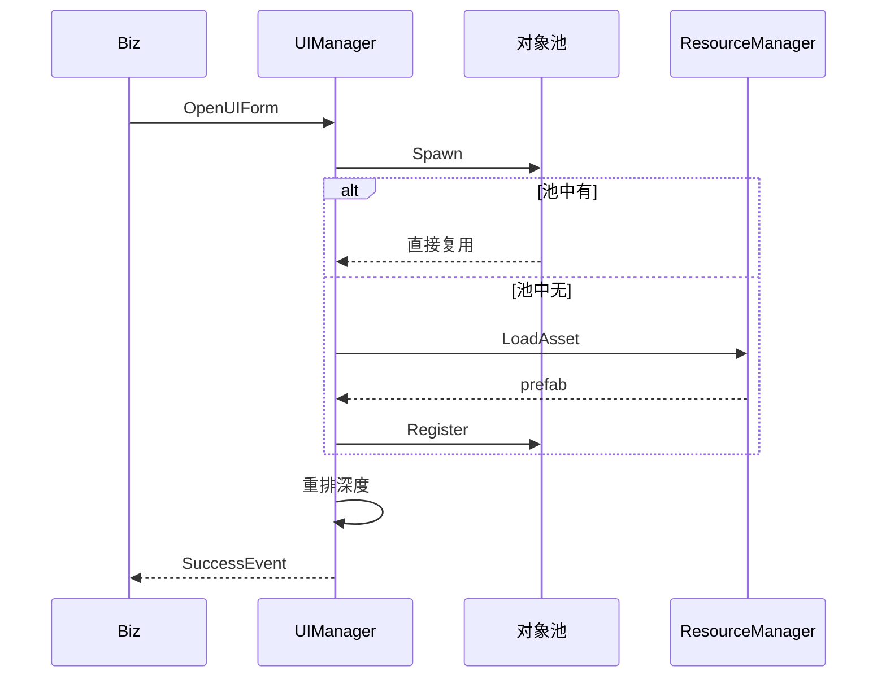

## 13. UI 分组

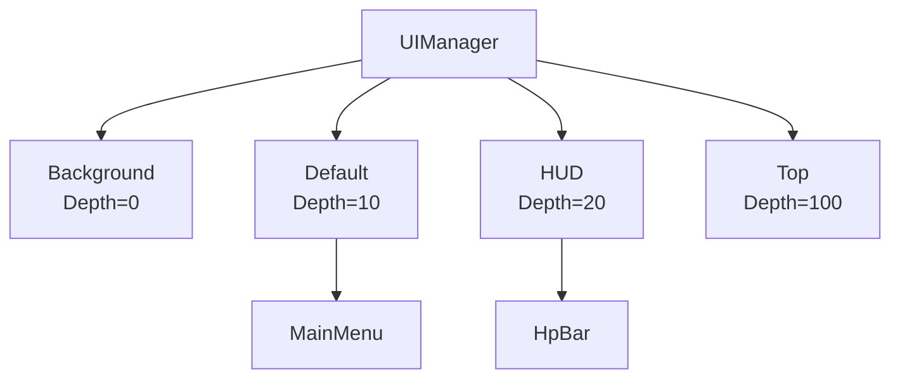

## 14. 网络通信

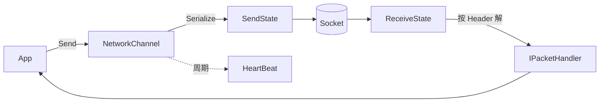

## 15. FileSystem 文件格式

```
┌─────────────────────────┐
│ HeaderData              │  魔法字 + 加密 + 最大文件数 + 最大块数
├─────────────────────────┤
│ StringData[]            │  文件名字符串区
├─────────────────────────┤
│ BlockData[]             │  块表（StringIndex + Offset + Length）
├─────────────────────────┤
│ Block 数据区             │  实际文件内容（按块对齐）
└─────────────────────────┘
```
